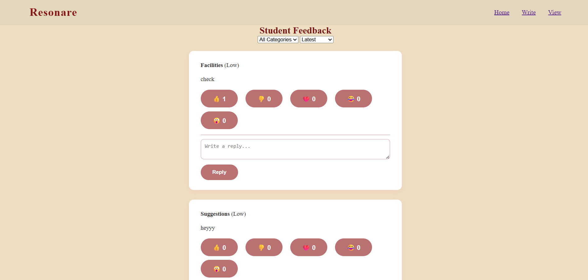
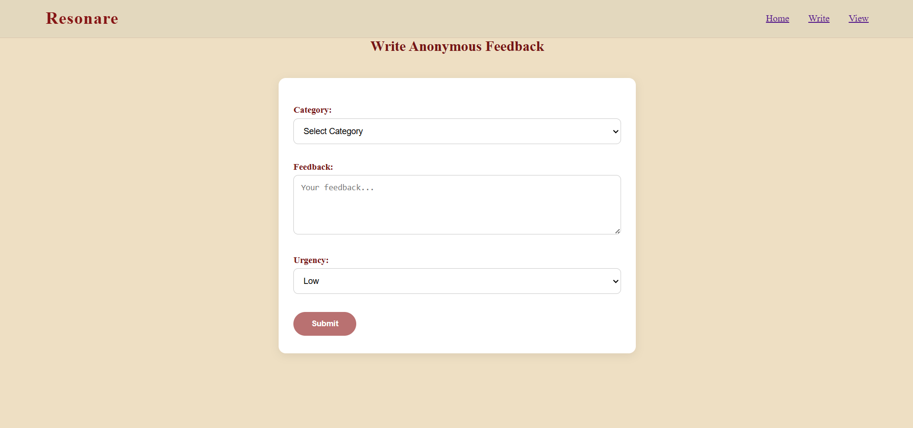
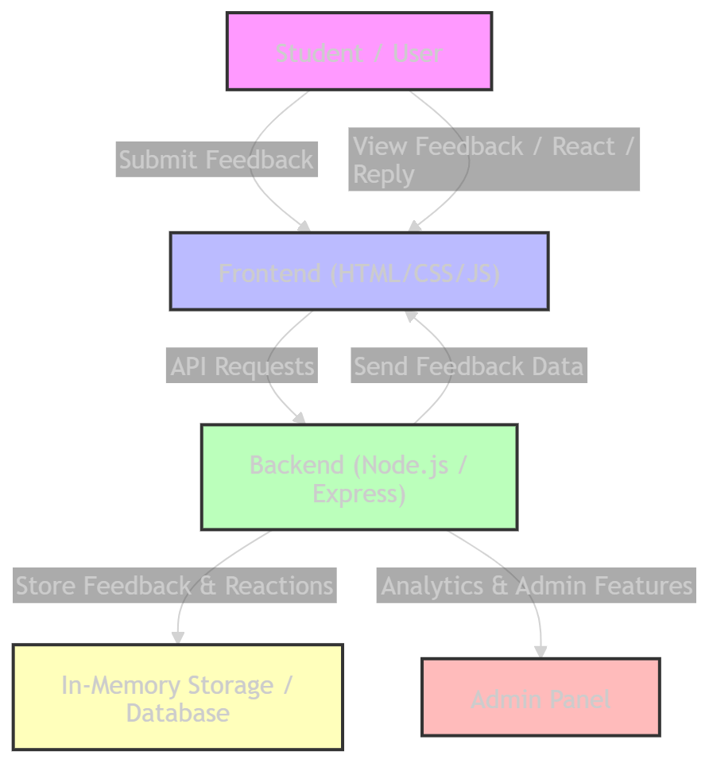

<p align="center">
  
</p>

# [Resonare] 🎯

## Basic Details

### Team Name: [Luther]

### Team Members
- Member 1: [Niveditha C M] - [TKM College of engineering]
- Member 2: [Jiyanna Susan] - [TKM College of engineering]

### Hosted Project Link
[https://github.com/ncm2005/Luther-Resonare]

### Project Description
[Resonare is an anonymous feedback portal for college students, allowing them to submit, view, and react to feedback safely. It helps improve communication, address concerns, and promote transparency within the college community]

### The Problem statement
[In many colleges, students hesitate to share their honest opinions or concerns due to fear of judgment or exposure. Existing feedback systems are often ineffective, non-anonymous, or lack real-time engagement, making it difficult for administration to understand and address student issues.]

### The Solution
[Resonare provides a secure, anonymous, and user-friendly platform for students to submit feedback. It allows real-time sharing of opinions, reactions, and replies while maintaining privacy, enabling college authorities to understand student concerns effectively and take timely actions]

---

## Technical Details

### Technologies/Components Used

**For Software:**
- Languages used: [avaScript,HTML,CSS,Node.js]
- Frameworks used: [Express.js ,LocalStorage]
- Tools used: [VS Code, Git, Browser]

**For Hardware:**
- Main components: [List main components]
- Specifications: [Technical specifications]
- Tools required: [List tools needed]

---

## Features

List the key features of your project:
- Feature 1:[Anonymous Feedback Submission – Students can submit feedback safely without revealing their identity.]
-Feature 2: [Feedback Viewing & Filtering – Users can view all submitted feedback and filter them by category or urgency.]
-Feature 3: [Reactions & Emojis – Users can react to feedback using like, dislike, and emoji options to express opinions.]
-Feature 4: [Reply to Feedback – Users can reply to feedback messages, creating discussions while keeping identities anonymous]

---

## Implementation

### For Software:

#### Installation
```bash
[# Clone the repository
git clone https://github.com/ncm2005/Resonare.git
cd Resonare

# Install backend dependencies
npm install]
```

#### Run
```bash
[# Start the backend server
node tinker.js

# Open frontend files (HTML) in a browser
# Or if you want live server preview in VS Code:
# Right-click index.html > Open with Live Server]
```

### For Hardware:

#### Components Required
[List all components needed with specifications]

#### Circuit Setup
[Explain how to set up the circuit]

---

## Project Documentation

### For Software:

#### Screenshots (Add at least 3)


*The home page of Resonare showing navigation bar, main title, and access to Write/View Feedback sections.*


*The View Feedback page displaying submitted feedbacks, reactions (emojis), and reply option.*


*The Write Feedback page where students can submit anonymous feedback with category and urgency selection.*

#### Diagrams

**System Architecture:**


*Student / User: Submits feedback and reacts to existing feedback.
-Frontend (HTML/CSS/JS): Collects inputs, displays feedback, reacts to backend APIs.
-Backend (Node.js/Express): Handles all API requests, stores feedback, manages reactions and replies, serves analytics.
-In-Memory Storage / Database: Stores all feedback data, reactions, and replies.
-Admin Panel: Allows admin to log in and view analytics, moderate, or filter feedback.*

**Application Workflow:**


*1.User opens the app → sees the home page with options.
2.Write Feedback → fills form → submitted to backend, stored in memory or database.
3.View Feedback → frontend fetches feedback → displays cards.
4.User can react (like, dislike, emoji) or reply → updates backend → frontend refreshes to show latest counts and replies.*

---

### For Hardware:

#### Schematic & Circuit


*Add caption explaining connections*


*Add caption explaining the schematic*

#### Build Photos


*List out all components shown*


*Explain the build steps*


*Explain the final build*

---

## Additional Documentation

### For Web Projects with Backend:

#### API Documentation

**Base URL:** `https://api.yourproject.com`

##### Endpoints

**GET /api/endpoint**
- **Description:** [What it does]
- **Parameters:**
  - `param1` (string): [Description]
  - `param2` (integer): [Description]
- **Response:**
```json
{
  "status": "success",
  "data": {}
}
```

**POST /api/endpoint**
- **Description:** [What it does]
- **Request Body:**
```json
{
  "field1": "value1",
  "field2": "value2"
}
```
- **Response:**
```json
{
  "status": "success",
  "message": "Operation completed"
}
```

[Add more endpoints as needed...]

---

### For Mobile Apps:

#### App Flow Diagram


*Explain the user flow through your application*

#### Installation Guide

**For Android (APK):**
1. Download the APK from [Release Link]
2. Enable "Install from Unknown Sources" in your device settings:
   - Go to Settings > Security
   - Enable "Unknown Sources"
3. Open the downloaded APK file
4. Follow the installation prompts
5. Open the app and enjoy!

**For iOS (IPA) - TestFlight:**
1. Download TestFlight from the App Store
2. Open this TestFlight link: [Your TestFlight Link]
3. Click "Install" or "Accept"
4. Wait for the app to install
5. Open the app from your home screen

**Building from Source:**
```bash
# For Android
flutter build apk
# or
./gradlew assembleDebug

# For iOS
flutter build ios
# or
xcodebuild -workspace App.xcworkspace -scheme App -configuration Debug
```

---

### For Hardware Projects:

#### Bill of Materials (BOM)

| Component | Quantity | Specifications | Price | Link/Source |
|-----------|----------|----------------|-------|-------------|
| Arduino Uno | 1 | ATmega328P, 16MHz | ₹450 | [Link] |
| LED | 5 | Red, 5mm, 20mA | ₹5 each | [Link] |
| Resistor | 5 | 220Ω, 1/4W | ₹1 each | [Link] |
| Breadboard | 1 | 830 points | ₹100 | [Link] |
| Jumper Wires | 20 | Male-to-Male | ₹50 | [Link] |
| [Add more...] | | | | |

**Total Estimated Cost:** ₹[Amount]

#### Assembly Instructions

**Step 1: Prepare Components**
1. Gather all components listed in the BOM
2. Check component specifications
3. Prepare your workspace

*Caption: All components laid out*

**Step 2: Build the Power Supply**
1. Connect the power rails on the breadboard
2. Connect Arduino 5V to breadboard positive rail
3. Connect Arduino GND to breadboard negative rail

*Caption: Power connections completed*

**Step 3: Add Components**
1. Place LEDs on breadboard
2. Connect resistors in series with LEDs
3. Connect LED cathodes to GND
4. Connect LED anodes to Arduino digital pins (2-6)

*Caption: LED circuit assembled*

**Step 4: [Continue for all steps...]**

**Final Assembly:**

*Caption: Completed project ready for testing*

---

### For Scripts/CLI Tools:

#### Command Reference

**Basic Usage:**
```bash
python script.py [options] [arguments]
```

**Available Commands:**
- `command1 [args]` - Description of what command1 does
- `command2 [args]` - Description of what command2 does
- `command3 [args]` - Description of what command3 does

**Options:**
- `-h, --help` - Show help message and exit
- `-v, --verbose` - Enable verbose output
- `-o, --output FILE` - Specify output file path
- `-c, --config FILE` - Specify configuration file
- `--version` - Show version information

**Examples:**

```bash
# Example 1: Basic usage
python script.py input.txt

# Example 2: With verbose output
python script.py -v input.txt

# Example 3: Specify output file
python script.py -o output.txt input.txt

# Example 4: Using configuration
python script.py -c config.json --verbose input.txt
```

#### Demo Output

**Example 1: Basic Processing**

**Input:**
```
This is a sample input file
with multiple lines of text
for demonstration purposes
```

**Command:**
```bash
python script.py sample.txt
```

**Output:**
```
Processing: sample.txt
Lines processed: 3
Characters counted: 86
Status: Success
Output saved to: output.txt
```

**Example 2: Advanced Usage**

**Input:**
```json
{
  "name": "test",
  "value": 123
}
```

**Command:**
```bash
python script.py -v --format json data.json
```

**Output:**
```
[VERBOSE] Loading configuration...
[VERBOSE] Parsing JSON input...
[VERBOSE] Processing data...
{
  "status": "success",
  "processed": true,
  "result": {
    "name": "test",
    "value": 123,
    "timestamp": "2024-02-07T10:30:00"
  }
}
[VERBOSE] Operation completed in 0.23s
```

---

## Project Demo

### Video
[Add your demo video link here - YouTube, Google Drive, etc.]

*Explain what the video demonstrates - key features, user flow, technical highlights*

### Additional Demos
[Add any extra demo materials/links - Live site, APK download, online demo, etc.]

---

## AI Tools Used (Optional - For Transparency Bonus)

If you used AI tools during development, document them here for transparency:

**Tool Used:** [e.g., GitHub Copilot, v0.dev, Cursor, ChatGPT, Claude]

**Purpose:** [What you used it for]
- Example: "Generated boilerplate React components"
- Example: "Debugging assistance for async functions"
- Example: "Code review and optimization suggestions"

**Key Prompts Used:**
- "Create a REST API endpoint for user authentication"
- "Debug this async function that's causing race conditions"
- "Optimize this database query for better performance"

**Percentage of AI-generated code:** [Approximately X%]

**Human Contributions:**
- Architecture design and planning
- Custom business logic implementation
- Integration and testing
- UI/UX design decisions

*Note: Proper documentation of AI usage demonstrates transparency and earns bonus points in evaluation!*

---

## Team Contributions

- [Name 1]: [Specific contributions - e.g., Frontend development, API integration, etc.]
- [Name 2]: [Specific contributions - e.g., Backend development, Database design, etc.]
- [Name 3]: [Specific contributions - e.g., UI/UX design, Testing, Documentation, etc.]

---

## License

This project is licensed under the [LICENSE_NAME] License - see the [LICENSE](LICENSE) file for details.

**Common License Options:**
- MIT License (Permissive, widely used)
- Apache 2.0 (Permissive with patent grant)
- GPL v3 (Copyleft, requires derivative works to be open source)

---

Made with ❤️ at TinkerHub
